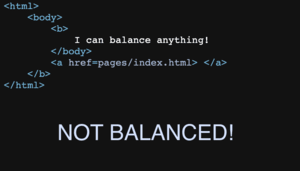

Portfolio
=========

Programming Projects
--------------------

*For access to my private project repositories, please [email me](mailto:andurel@csustudent.net?subject=GitHub%20Access) with the subject line, GitHub Access.

---
### [HTML Parser | CSCI 315](project1)

---
### [Minimal Overlap Coverage | CSCI 315](project2)

---
### [Text-Based Adventure Game | CSCI 325](project3)

---
### [UDP File Transfer | CSCI 332](project4)

---

Ethics Papers
-------------

### [The Good Hacker](/pdf/The Good Hacker.pdf)

-   **Class: Procedural Programming (CSCI 235)**  
-   **Grade: 95**

### [How Much Testing is Enough?](/pdf/How Much Testing is Enough.pdf)

-   **Class: Data Structures Analysis (CSCI 315)** 
-   **Grade: 90**

### [Cyber Espionage](/pdf/Cyber Espionage - Durel.pdf)

-   **Class: Principles of Cybersecurity (CSCI 405)** 
-   **Grade: 100**

---

Presentations
-------------

### [Keylogging - XSS](/pdf/Keylogging-XSS.pdf)

- **Class: Survey of Scripting Languages (CSCI 301)** 
- **Grade: 100**

### [Rootkits](/pdf/Rootkits.pdf)

- **Class: Computer Architecture (CSCI 330)** 
- **Grade: 100**

---

Page template forked from <a href="https://github.com/csu-cs/csci-portfolio">CSU-CS</a>

<!-- Remove above link if you don't want to attributive -->
