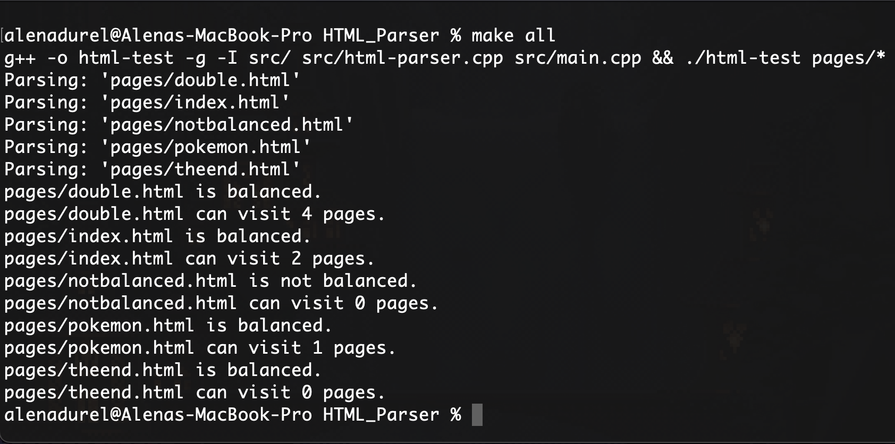
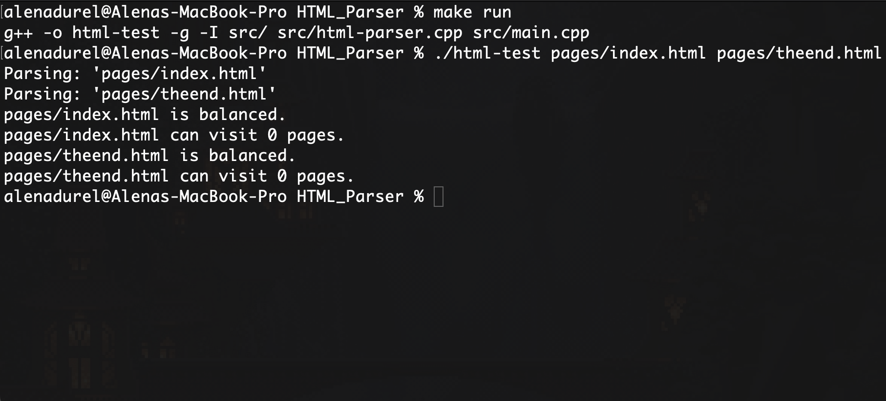
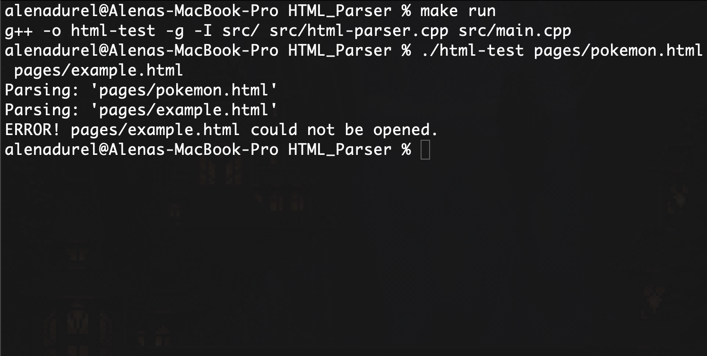

[Back to Portfolio](./)

HTML Parser
===============

-   **Class: Data Structures Analysis (CSCI 315)** 
-   **Grade: 100** 
-   **Language(s): C++** 
-   **Source Code Repository:** [alenanicole/HTML-Parser](https://github.com/alenanicole/HTML-Parser)  
    (Please [email me](mailto:andurel@csustudent.net?subject=GitHub%20Access) to request access.)

## Project description

This project is an HTML Parser that completed two tasks for each HTML Page passed to it. First, it will determine if the HTML tags are balanced on the page. Second, it finds the number of unique webpages that can be visited from a certain HTML page. If the webpage is unbalanced, it will not be able to visit any links, and every link must be valid (the page must exist and be passed into the program). A page can visit multiple pages from a single link, if the page that they visit links to another page. However, each page will only count the first time that it is visited. This project was coded in C++.

## How to compile and run the program

First, please download and extract the 'HTML_Parser.zip' file from the Source Code folder. Once you have navigated to the correct directory in your terminal, this project can easily be compiled and ran using a simple make command.

```
make all
```
If you would like to run the program with specific pages, please use:

```
make run
./html-test pages/example_filename pages/example_filename
```
This method can be used to run the program with any number of pages available to the user. These pages currently include index.html, double.html, pokemon.html, notbalanced.html, and theend.html, however, the user can add more to test.

To remove the executable please use:
```
make clean
```
## UI Design

This program will parse the HTML files passed to it and will determine if they are balanced. It will also track the number of unique webpages that the HTML file can visit. The user can run the program with any number of the files provided in the 'Pages' folder, or can create new pages to test. This project contains minimal user interaction besides passing filenames as arugments into the program when it is first run. The program will then check if the page is balanced and how many pages it can visit without prompting from the user.

**NOTE:** According to this project's requirements, this program was made with the intention to parse HTML files that do not contain '<', '>', or '=' symbols anywhere in the file besides HTML tags.

************

This project can be run with all of the pages contained in the 'pages' folder (See Fig. 1). Please see explanations for each file's output below.

  
**Fig 1. Testing All Pages**

```html
// notbalanced.html
<html>
    <body>
        <b>
            I can balance anything!
        </body>
        <a href=pages/index.html> </a>
    </b>
</html>
```
**'notbalanced.html' is, as the name suggests, not balanced. Therfore, it cannot visit any webpages even though it contains a link to 'index.html'**
<br> <br>
```html
// theend.html
<html>
    <body>
        <b>
            The End.
        </b>
    </body>
</html>
```
**'theend.html' is balanced. However, it contains no links and contain visit any webpages**
<br> <br>
```html
// pokemon.html
<html>
    <body>
        <b>
            WHY!?
        </b>
	<a href=pages/theend.html></a>
    </body>
</html>
```
**'pokemon.html' is balanced. It has one link to 'theend.html', which is a deadend. Therefore, it can visit 1 page.**
<br> <br>
```html
// index.html
<html>
    <body>
        <b>
            Hello, World!
        </b>
	<a href=pages/pokemon.html></a>
    </body>
</html>
```
**'index.html' is balanced. It links to 'pokemon.html', which links to 'theend.html'. Therefore, it can visit 2 pages.**
<br> <br>
```html
// double.html
<html>
    <body>
        <b>
            Double
        </b>
		<a href=pages/double.html></a>
		<a href=pages/index.html></a>
        <a href=pages/pokemon.html></a>
		<a href=pages/theend.html></a>
    </body>
</html>
```
**'double.html' is balanced. This page can visit multiple links through the various webpages it links to, including itself. However, the unique number of pages that is 4, as each page is only counted once.**
<br> <br>

*********

This project can be run with any number of the pages provided (See Fig. 2). Passing in 'index.html' and 'theend.html', the program will determine that both of these files are balanced, and that neither can currently visit any pages. The 'theend.html' file does not contain any links, therefore it cannot visit any pages, however, the 'index.html' file does have a link. Even though 'index.html' links to another page, this file was not passed into the program, and therefore cannot be visited.

  
**Fig 2. Testing Only Two Pages**

*********

When this project is passed a file that cannot be opened or does not exist, it will quit the program when this file is parsed (See Fig. 3). For this example, 'pokemon.html' and 'example.html' are passed into the program. Since 'pokemon.html' exists and can be opened, it will be parsed correctly. However, 'example.html' will output an error message and terminate the program since it does not exist.

  
**Fig 3. Testing With a File that Doesn't Exist**

## 3. Additional Considerations

Even though this project was made to parse basic HTML pages, using `<html>`, `<body>`, `<b>`, `<i>`, and `<a href=>` tags, I believe that it could be modified and expanded to accomadate a larger variety of tags. 

<!---
For more details see [GitHub Flavored Markdown](https://guides.github.com/features/mastering-markdown/).
-->
[Back to Portfolio](./)
