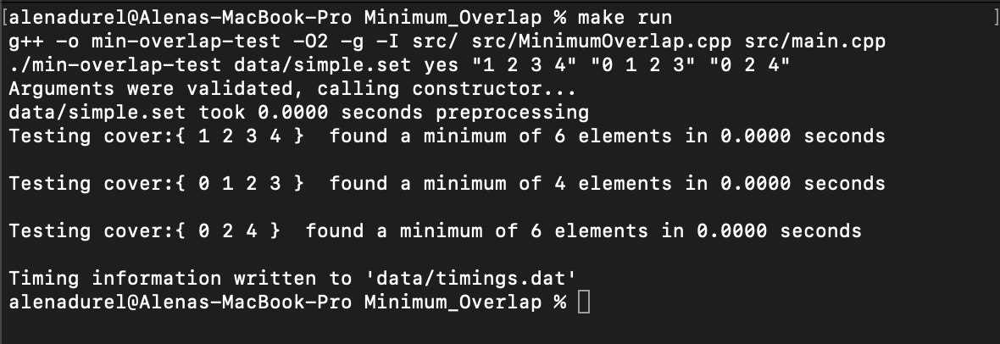
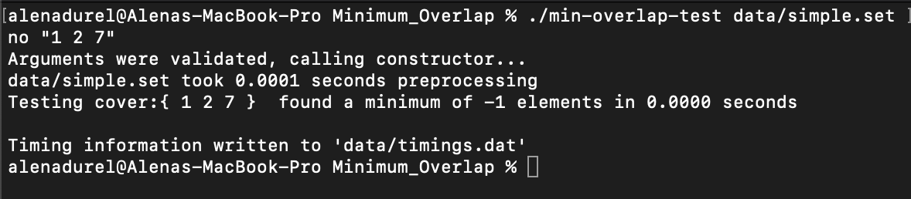
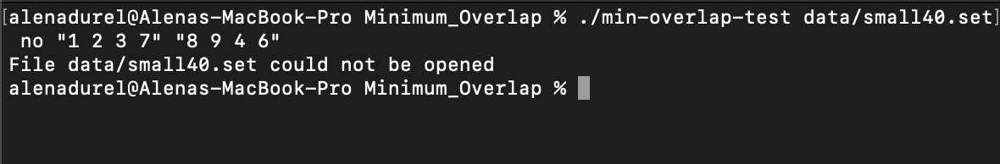

[Back to Portfolio](./)

Minimal Overlap Coverage
===============

-   **Class: Data Structures Analysis (CSCI 315)** 
-   **Grade: 90** 
-   **Language(s): C++** 
-   **Source Code Repository:** [alenanicole/Minimal-Overlap-Coverage]([https://github.com/alenanicole/Minimal-Overlap-Coverage])  
    (Please [email me](mailto:andurel@csustudent.net?subject=GitHub%20Access) to request access.)

## Project description

This project is used to find the minimal overlap needed to complete a query request. A file containing multiple groups, where each group will contain a set of unique numbers, is passed into the program. Each query will consist of a set of numbers, that do not need to be unique. When a group is used in the cover, each element in that group must be counted. For example, if one of the groups is {1, 2, 4, 5} all four elements must be counted and it is not possible to just count {2, 5} if that is all you need. The goal of this project is to determine the minimal number of elements needed to cover the query. If there is no possible overlap, the program will return -1, otherwise it will return the minimum number of elements to cover the query. This project was coded in C++.

## How to compile and run the program

The makefile included in the source code contains a various number of tests for this project. The makefile commands include:

    run -> runs the program on simple.set

    small30 -> runs the program on small30.set

    med30 -> runs the program on medium30.set

    large30 -> runs the program on large30.set

    large50 -> runs the program on large50.set

    small100 -> runs the program on small100.set

There are also "-timings" commands that will test the same sets but with a larger number of queries:

    small-timings

    medium-timings

    large30-timings

    large-timings

**NOTE:** The number (30, 50, 100) in the file name refers to how many sets are in that data file. The size (small, medium, large) refers to the average number of elements in a set as well as how large the numbers in the set might be.

Any of these tests can be run using the following command (fill in blank with test name):

```
 make ____________
```

This program can also be run with queries different than the ones provided in the makefile. For example, you can test the small30.set with only one query, "1 2 3 4". Adding the argument "yes" or "no" to the command tells the program whether or not to print out debugging information.

```
 ./min-overlap-test data/small30.set no "1 2 3 4"
```

## UI Design

This program will parse the data file passed to it and will determined the minimum number of elements needed to cover each query passed in. The user can run any of the tests predefined in the makefile, or can create their own tests. This project requires little human interaction besides passing arguments into the program when it is first run. From there, the program will run on its own, finding the solution to each query.

  
**Fig 1. Running the program on simple.set**

  
**Fig 2. No solution could be found for a query**

  
**Fig 3. Testing invalid file**

## Additional Considerations
The pseudocode for the algorithm this project optimizes was provided by Dr. Paul West.


[Back to Portfolio](./)
