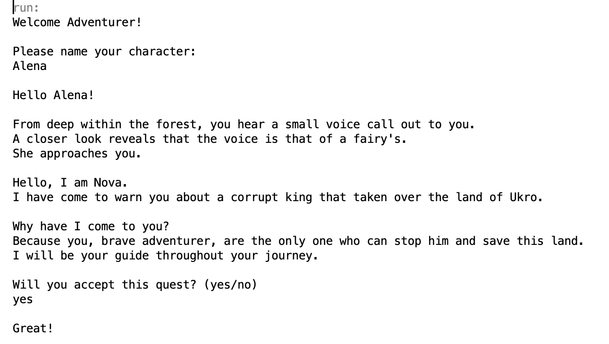
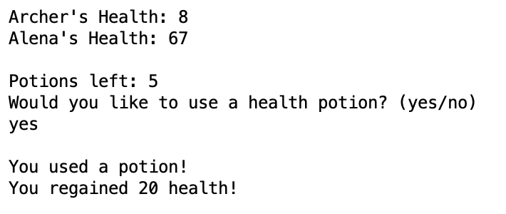
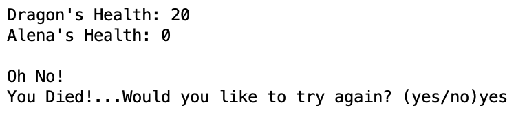
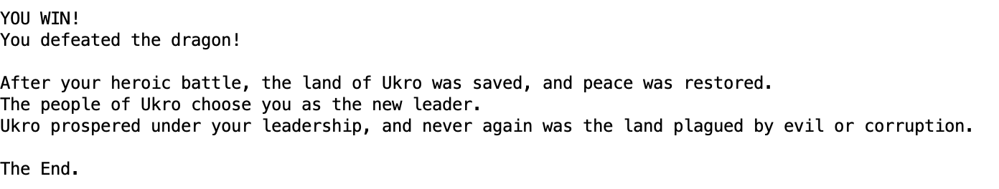

[Back to Portfolio](./)

Text-Based Adventure Game
===============

-   **Class: Object-Oriented Programming (CSCI 325)** 
-   **Grade: 100** 
-   **Language(s): Java** 
-   **Source Code Repository:** [alenanicole/Castle-Of-Conquest](https://github.com/alenanicole/Castle-Of-Conquest)  
    (Please [email me](mailto:andurel@csustudent.net?subject=GitHub%20Access) to request access.)

## Project description

Castle of Conquest is a text-based adventure game where a player traverses through a series of areas, fighting monsters along the way. The player must make their way through four levels before they face off against the final boss to protect their land and win the game. Your hero, guided by a fairy named Nova, must find their way through the land of Ukro to stop the corrupted king in his evil ways. This was a team project completed by Bryce Furrow, James Way, Camryn Shuler, and I. This project was coded in Java.

## How to compile and run the program

Step 1: Install the Netbeans IDE.

Step 2: Downlod the .zip file from the Github repository.

Step 3: Launch the Netbeans IDE and select “Open Project”.

Step 4: Navigate to the project folder.

Step 5: Open the project.

Step 6: Highlight the “CastleOfConquest.java” file.

Step 7: Click “Run Project”.

## UI Design

This project is somewhat user interactive, requiring the user to navigate throughout the world. While it is a very linear path and all of the battles are automatically generated and run by the program, the user must make some decisions. First, the user must name their character and decide to begin their noble quest. Then, they must decide when they want to use their limited supply of health potions throughout their battles in order to make it to the final boss. For a full playthrough and demonstration of the game please watch the demo linked below.

  
**Fig 1. Naming your character and accepting the quest**

  
**Fig 2. Using a health potion**

  
**Fig 3. Retrying a level when you die**

  
**Fig 3. Beating the game**

## Demo

## Additional Considerations

This projects could not have been accomplished without the help of my group: Bryce Furrow, James Way, and Camryn Shuler.

I have since recreated this project on my own, adding in more features and making the game longer. It can be found [here](./recode.md)

[Back to Portfolio](./)
